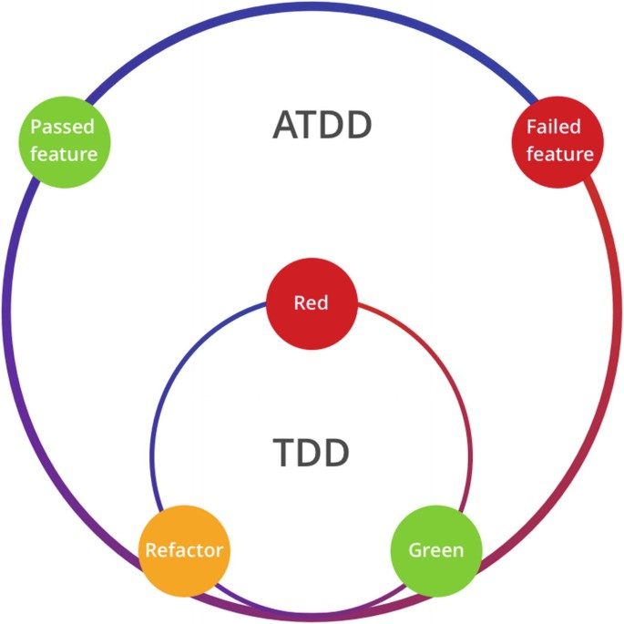

# Testing

## ATDD

- Empezamos con las features (lo más cercano al cliente | usuario) (en rojo)
  - Implementamos los test [unitarios, integración...] necesarios para cubrir la feature (en rojo)
  - Implementamos los test [unitarios, integración...] necesarios para cubrir la feature (en verde)
- Finalizamos con las features (lo más cercano al cliente | usuario) (en verde)
